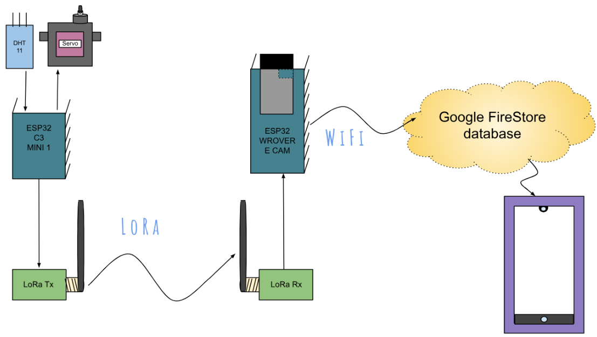
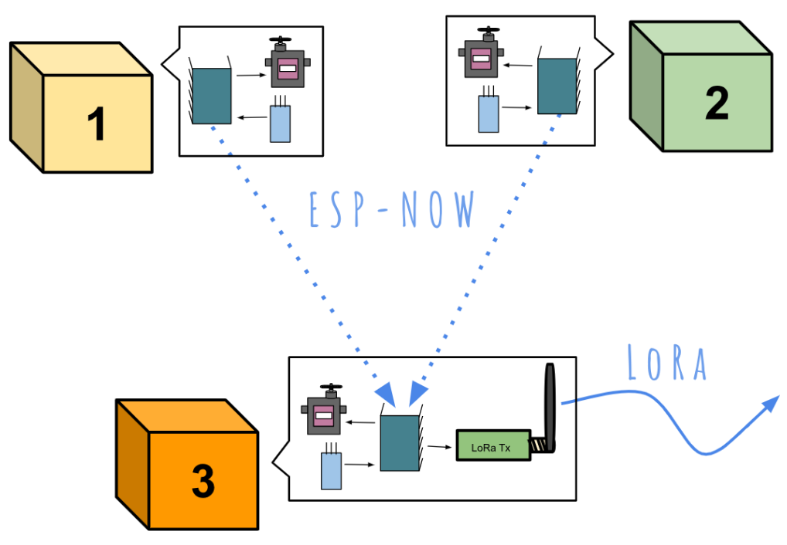
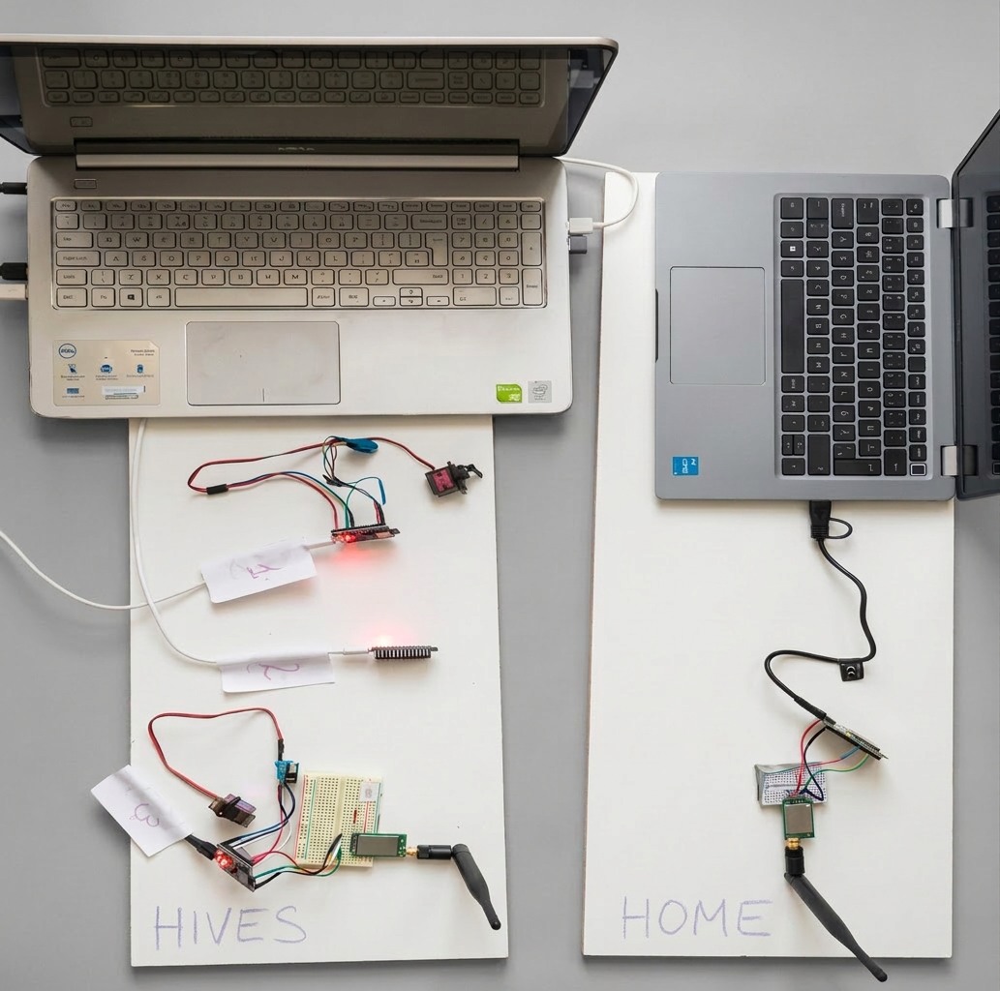
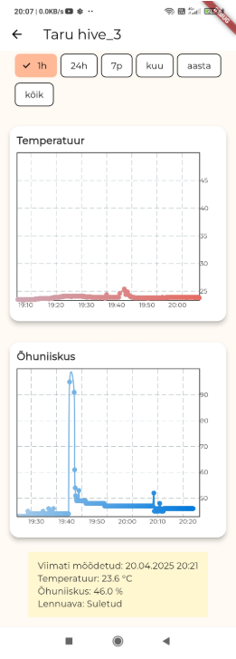
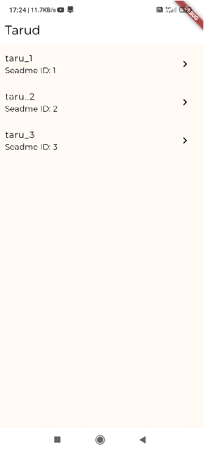

#  Design and Development of a Smart Beehive Prototype

*A scalable, low power IoT monitoring prototype for precision apiculture.*

**Nominated for 'Best Thesis' 2025 by Clevon Academy & EEK Mainor.**

# 1. The Challenge
High winter mortality (up to 35% in Europe) is driven by critical hive thermodynamics. Manual monitoring is intrusive and causes heat loss. This project delivers a non-invasive, remote monitoring system that helps prevent starvation and health risks.

# 2. Hardware & Network

<em>Figure 1: High-Level System Architecture and Communication Protocols</em>

## Network Topology:
Star network using **ESP-NOW** for scalable, low-latency device-to-device communication without the need for localized LoRa at each hive.

 
<em>Figure 2: Multi-node Star Topology and Scalability</em>

## Edge Nodes:
**ESP32-C3 Mini-1** microcontrollers utilizing deep sleep modes to optimize power for remote deployments.
## Gateway:
**ESP32-WROVER-E CAM** acting as the bridge to Firebase Firestore via WiFi.
## Closed-Loop Automation
Implemented **closed-loop automation** via actuator logic. Real-time environmental data (temperature) triggers an automated physical gate regulation simulated with **Tower Pro MG90S** servos.
## Connectivity & Resilience:
Integrated **LoRa (868 MHz)** and **ESP-NOW** protocols to ensure robust, infrastructure-independent performance in remote agricultural environments, prioritizing edge-case connectivity where standard cellular networks fail.

## Hardware Integration & System Verification
The final hardware assembly demonstrates the integration of the ESP32-C3 nodes with DHT sensors and gate actuators. This setup was used to verify the star-topology communication stability and sensor data accuracy during final testing.

 
<em>Figure 3: Functional Prototype Testing</em>

# 3. Software & Optimization

&nbsp;&nbsp;&nbsp;&nbsp;

<em>Figure 4: Flutter Mobile Interface: Real-Time Telemetry and Multi-Hive Management</em>

## Memory Management:

Implemented custom **C++ Structs** to minimize payload size and optimize power efficiency.

## State Management:
Used the **BLoC pattern** in Flutter to create a reactive, scalable, and testable mobile UI.

# 4. Methodology
## User-Centric Design 
Project delivery was based on **persona research** and **iterative prototyping**. The solution was refined through multiple feedback iterations of primary research with Estonian beekeepers, to ensure the prototype was functional, intuitive, and directly solved their specific pain points.